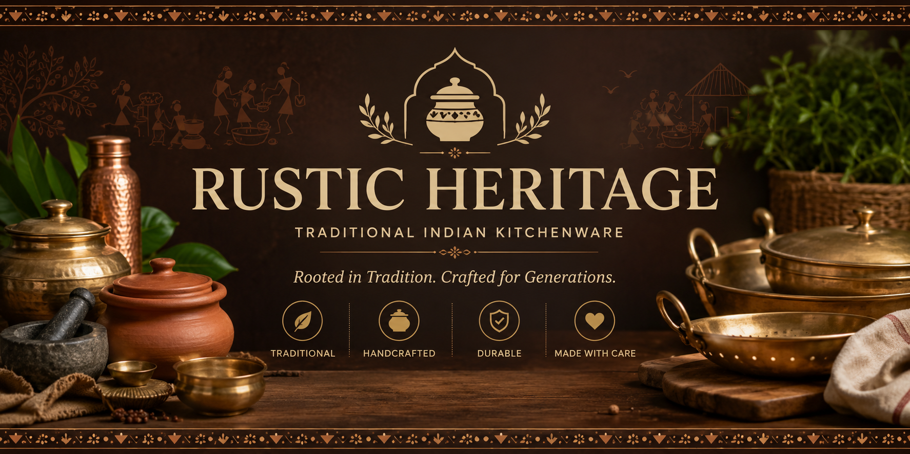

<p align="center">
  
</p>

<h1 align="center">🏺 Rustic Heritage</h1>

<p align="center">
A modern <b>Traditional Indian Kitchenware E-Commerce Website</b> featuring authentication, secure online payments, shopping cart, order management, admin dashboard, and a responsive user experience.
</p>

<p align="center">


</p>

---

# 🚀 Live Website

### 🌐 https://rustic-heritage.netlify.app/

---

# 📖 About

Rustic Heritage is a modern e-commerce platform dedicated to traditional Indian kitchenware and handcrafted household products.

The website combines traditional Indian aesthetics with a modern shopping experience, allowing customers to explore products, manage their cart, place orders, make secure online payments, and manage their profiles.

The platform also includes an admin dashboard for managing products, orders, customers, reviews, enquiries, subscribers, and other store operations.

---

# ✨ Features

- 🏺 Traditional Indian Kitchenware Store
- 🔐 Secure User Authentication
- 💳 Razorpay Online Payment Integration
- 🛒 Shopping Cart & Checkout
- 📦 Order Management & Tracking
- 👤 User Profile Management
- 📊 Admin Dashboard
- 🛍️ Product Catalogue Management
- ⭐ Customer Reviews & Stories
- 📧 Email Notifications
- 📱 Fully Responsive Design
- 🔎 Product Search & Category Filtering
- ⚡ Fast & Interactive React UI

---

# 🛠 Tech Stack

| Technology | Usage |
|------------|------|
| React | Frontend UI & Application |
| Vite | Development & Build Tool |
| JavaScript | Application Logic |
| CSS3 | Styling & Responsive Design |
| Supabase | Authentication & Database |
| Razorpay | Secure Online Payments |
| Netlify Functions | Backend APIs |
| Netlify | Deployment |

---

# 📂 Project Structure

```text
Rustic_Heritage/
│
├── api/
│   ├── admin-actions.js
│   ├── create-razorpay-order.js
│   ├── newsletter-subscribe.js
│   ├── send-order-email.js
│   ├── send-order-status.js
│   ├── send-welcome-email.js
│   └── verify-razorpay-payment.js
│
├── public/
│   └── images/
│
├── src/
│   ├── admin/
│   │   ├── AdminCoupons.jsx
│   │   ├── AdminDashboard.jsx
│   │   ├── AdminEnquiries.jsx
│   │   ├── AdminOrders.jsx
│   │   ├── AdminProducts.jsx
│   │   ├── AdminReviews.jsx
│   │   ├── AdminSubscribers.jsx
│   │   └── AdminUsers.jsx
│   │
│   ├── components/
│   │   ├── AuthModal.jsx
│   │   ├── CartDrawer.jsx
│   │   ├── CheckoutModal.jsx
│   │   ├── Footer.jsx
│   │   ├── Navbar.jsx
│   │   ├── ProductCard.jsx
│   │   └── ProductDetailModal.jsx
│   │
│   ├── context/
│   │   ├── AuthContext.jsx
│   │   └── CartContext.jsx
│   │
│   ├── pages/
│   │   ├── Home.jsx
│   │   ├── Products.jsx
│   │   ├── Profile.jsx
│   │   ├── Reviews.jsx
│   │   ├── Contact.jsx
│   │   └── GetInTouch.jsx
│   │
│   ├── services/
│   │   ├── auth.js
│   │   ├── invoice.js
│   │   ├── orders.js
│   │   ├── payment.js
│   │   ├── products.js
│   │   ├── reviews.js
│   │   └── newsletter.js
│   │
│   ├── lib/
│   │   └── supabase.js
│   │
│   ├── App.jsx
│   ├── main.jsx
│   └── styles.css
│
├── index.html
├── package.json
├── package-lock.json
├── supabase_master_setup.sql
├── vercel.json
├── vite.config.js
└── README.md

```text
```

# 🎯 Key Highlights

✅ Modern Traditional Indian Kitchenware E-Commerce Website

✅ React + Vite Architecture

✅ Secure Authentication with Supabase

✅ Supabase Database Integration

✅ Razorpay Payment Gateway Integration

✅ Shopping Cart & Checkout System

✅ Customer Order Management

✅ Admin Dashboard

✅ Product & Catalogue Management

✅ Customer Reviews & Enquiries

✅ Email Notification System

✅ Invoice Generation

✅ Fully Responsive UI/UX

# 👨‍💻 Developed By
Mathu Bharathi A

Biomedical Engineer • Full Stack Developer • Graphic Designer

# 📄 License

This project is developed for educational and portfolio purposes.

© 2026 Rustic Heritage. All Rights Reserved.
